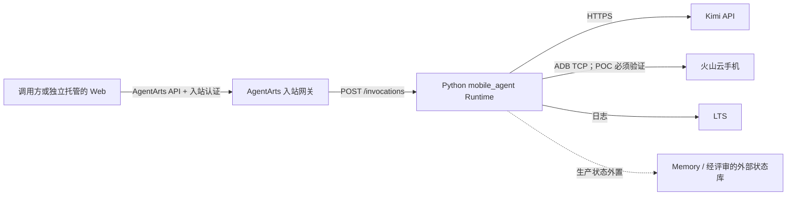

# Mobile Use Agent 容器发布至华为云 AgentArts 报告

> 调研日期：2026-08-12
> 文档范围：华为云 AgentArts 高代码开发、智能体运行时、SWR 与当前 `mobile-use-agent` 仓库
> 证据原则：平台能力与限制只引用华为云官方文档；“已确认”表示官方文档明确说明，“建议/推断”表示基于平台契约给出的工程判断，不能视为华为云承诺。

## 1. 执行摘要

华为云 AgentArts 支持把已有 LangChain/LangGraph 应用作为 Docker 镜像托管，这与本项目的 Python Agent 技术栈方向一致。对已有自研代码，官方定义的“代码云上托管”模式是：本地开发、打包镜像、上传到云上运行环境，由 AgentArts 提供运行时托管和监控能力。[高代码开发概述](https://support.huaweicloud.com/highcode-agentarts/agentarts_10_001.html) [高代码开发流程](https://support.huaweicloud.com/highcode-agentarts/agentarts_10_002.html)

但“把仓库直接做成一个镜像并上传”并不足以完成发布。AgentArts HTTP 运行时要求镜像为 Linux ARM64，应用监听 `0.0.0.0:8080`，实现 `POST /invocations`，并建议实现 `GET /ping`；镜像还必须按弹性运行时的无状态、易失本地磁盘模型设计。[智能体运行时介绍](https://support.huaweicloud.com/highcode-agentarts/agentarts_10_029.html) [HTTP 入栈协议](https://support.huaweicloud.com/highcode-agentarts/agentarts_10_070.html)

建议采用“单独发布 Python `mobile_agent` 为 AgentArts HTTP Runtime，Web 前端与设备控制端按独立服务处理”的形态。其原因、当前代码差距和是否可把 Go MCP 另行发布为 AgentArts MCP Runtime，将在第 3～7 节结合仓库实现审计给出。

## 2. 华为云官方平台要求

### 2.1 支持的发布模式

官方提供两条发布路径：

1. **手工镜像路径**：制作符合 AgentArts 规范的镜像，上传到华为云容器镜像服务 SWR，再在 AgentArts 控制台选择镜像并托管运行时。[制作 Agent 镜像](https://support.huaweicloud.com/highcode-agentarts/agentarts_10_079.html) [通过控制台部署智能体运行时](https://support.huaweicloud.com/highcode-agentarts/agentarts_10_031.html)
2. **SDK/CLI 路径**：安装 `agentarts-sdk`，配置 Agent 入口、区域、依赖与 SWR 参数，执行 `agentarts launch`，CLI 自动完成本地构建、推送 SWR 和部署运行时。[通过 SDK 部署智能体运行时](https://support.huaweicloud.com/highcode-agentarts/agentarts_10_030.html)

对已有复杂仓库，手工镜像路径更容易精确控制构建上下文、依赖和启动入口；若采用 SDK/CLI 路径，也仍须先把业务入口适配成 AgentArts 的标准调用接口。官方基础示例使用 `AgentArtsRuntimeApp` 封装已有 Agent，并读取平台注入的 `AGENT_RUN_PORT`。[基础示例：创建基础对话智能体](https://support.huaweicloud.com/highcode-agentarts/agentarts_10_056.html)

### 2.2 HTTP Runtime 的强制契约

以下为官方明确要求：

| 项目 | AgentArts 要求 | 发布含义 |
| --- | --- | --- |
| 系统架构 | Linux ARM64 容器 | 必须生成 `linux/arm64` 镜像；按控制台/高代码文档，x86 镜像会导致调用失败。 |
| Host | `0.0.0.0` | 只监听回环地址的服务无法被运行时代理访问。 |
| 端口 | HTTP 标准端口 `8080` | Dockerfile、应用启动参数与控制台监听端口须一致。 |
| 主入口 | `POST /invocations` | 接收 JSON，响应可为普通 JSON 或 SSE。 |
| 双向流 | `WS /ws`，可选 | 只有需要 WebSocket 双向交互时实现。 |
| 健康检查 | `GET /ping` | 应返回 HTTP 200 与平台定义的健康状态。 |
| 状态/磁盘 | 运行时弹性且本地磁盘易失 | 不得把会话、SQLite、本地日志或缓存当作可靠持久化层。 |

来源：[智能体运行时介绍](https://support.huaweicloud.com/highcode-agentarts/agentarts_10_029.html)、[HTTP 入栈协议](https://support.huaweicloud.com/highcode-agentarts/agentarts_10_070.html)、[Dockerfile 参数在智能体运行时中如何使用](https://support.huaweicloud.com/highcode-agentarts/agentarts_10_052.html)。

Dockerfile 和控制台参数的对应关系为：

| Dockerfile | AgentArts 控制台 |
| --- | --- |
| `ENV` | 高级配置中的环境变量 |
| `ENTRYPOINT`、`CMD` | 启动命令 |
| `EXPOSE` | 监听端口 |

控制台的启动命令是可选项，最多 10 条，每条 1～256 个字符；如果启动命令包含端口，该端口必须与监听端口相同。当前官方页面没有明确解释控制台启动命令与镜像原有 `ENTRYPOINT/CMD` 是覆盖、追加还是其他组合语义，因此稳妥做法是让镜像自身具备完整、可用的默认启动命令，控制台不重复覆盖。[通过控制台部署智能体运行时](https://support.huaweicloud.com/highcode-agentarts/agentarts_10_031.html)

### 2.3 HTTP 路由和响应

`POST /invocations` 是 AgentArts HTTP 入栈的标准入口。普通响应应使用 JSON；长任务或增量输出可使用 `text/event-stream`。平台调用 API 的外部路径是 `POST /runtimes/{runtime_name}/invocations`，AgentArts 再把请求转发给容器入口。[HTTP 入栈协议](https://support.huaweicloud.com/highcode-agentarts/agentarts_10_070.html) [调用智能体运行时 API](https://support.huaweicloud.com/api-agentarts/InvokeRuntime1.html)

控制台还允许选择路由匹配方式：

- **严格匹配**：只匹配 `/runtimes/{runtime_name}/invocations`。
- **前缀匹配**：还可匹配 `/runtimes/{runtime_name}/invocations/{custom_path}`，便于镜像后续增加子路径。

以上是 AgentArts 外部调用路径策略，不能代替容器内部必须实现的 `/invocations`。[通过控制台部署智能体运行时](https://support.huaweicloud.com/highcode-agentarts/agentarts_10_031.html)

### 2.4 健康检查与实例回收

HTTP 协议页定义的 `/ping` 状态如下：

- `{"status":"Initing"}`：端口已可访问，但仍在初始化。
- `{"status":"Healthy"}`：服务已就绪且空闲。
- `{"status":"HealthyBusy"}`：服务健康，且有后台长任务正在运行。
- 无法连接、无响应、非 200 或返回不健康状态：视为不健康。

官方调用说明还明确：实例执行后每 5 秒探测一次；单次健康检查超时 1 秒；连续 3 次无响应或返回 `Unhealthy` 时，实例会被终止；实例默认空闲 15 分钟后回收。[HTTP 入栈协议](https://support.huaweicloud.com/highcode-agentarts/agentarts_10_070.html) [调用智能体运行时](https://support.huaweicloud.com/highcode-agentarts/agentarts_10_066.html)

文档存在一处需要保守处理的差异：调用说明称未实现 `/ping`、返回 404 时也可视为健康，但镜像制作页又警告健康检查失败会导致启动失败和实例反复重启。因此本项目不应依赖 404 宽松行为，应实现常数时间、不访问外部模型或设备的 `/ping`，并让运行中的长任务返回 `HealthyBusy`。[制作 Agent 镜像](https://support.huaweicloud.com/highcode-agentarts/agentarts_10_079.html)

### 2.5 无状态与持久化

AgentArts 运行时处于分布式弹性伸缩集群，沙箱可能因空闲回收或扩容而销毁，届时本地磁盘数据会丢失。官方禁止依赖本地文件系统保存可靠状态，并给出两类持久化方案：会话上下文使用 AgentArts Memory，实体文件使用 SFS Turbo。[智能体运行时介绍](https://support.huaweicloud.com/highcode-agentarts/agentarts_10_029.html)

如果使用 SFS Turbo：

- 出网网络须选择私网；
- SFS Turbo 与运行时须位于同一 VPC；
- 文件系统须为 NFS；
- 安全组须放通运行时子网访问 NFS；
- 单个运行时最多挂载 5 个存储；
- 官方明确提示不要在文件系统中存放敏感数据。

来源：[通过控制台部署智能体运行时](https://support.huaweicloud.com/highcode-agentarts/agentarts_10_031.html)。

### 2.6 SWR 构建与上传

手工发布的官方链路为：

```bash
docker build -t mobile-use-agent:<version> .

docker tag mobile-use-agent:<version> \
  swr.<region-id>.<domain>/<organization>/mobile-use-agent:<version>

docker push \
  swr.<region-id>.<domain>/<organization>/mobile-use-agent:<version>
```

关键约束：

- SWR 与 AgentArts 必须选择同一区域，否则 AgentArts 控制台无法选到镜像。
- 先在 SWR 创建组织，再从 SWR 控制台获取临时登录命令执行登录。
- 推送后可从 AgentArts 的“我的镜像”选择，也可使用共享镜像或镜像中心的镜像。
- 控制台部署文档要求使用非 `latest` 标签，并避免把不同内容重复推送到完全相同的镜像名与标签。建议使用版本号加 Git SHA 等不可变标签。
- 华为云文档称 SWR 基础版不支持 OCI 镜像格式；Docker 27 及以上遇到该问题时，可按官方指导关闭 OCI media type/BuildKit 相关行为。

来源：[制作 Agent 镜像](https://support.huaweicloud.com/highcode-agentarts/agentarts_10_079.html)、[通过控制台部署智能体运行时](https://support.huaweicloud.com/highcode-agentarts/agentarts_10_031.html)、[通过 SDK 部署智能体运行时](https://support.huaweicloud.com/highcode-agentarts/agentarts_10_030.html)。

### 2.7 控制台托管参数

控制台路径为“部署运行 > 智能体运行时 > 托管智能体”。需要配置：

1. 基本信息：运行时名称和描述；名称在账号内唯一，以小写字母开头，以小写字母或数字结尾，可包含小写字母、数字与中划线，长度 2～48。
2. 来源：选择已上传到 SWR 的 ARM64 镜像。
3. 委托：可使用平台默认的 `DefaultAgentArtsRuntimeAgency`。
4. 入站网关、入栈协议与入站身份认证。
5. 日志记录：开启后，运行日志上报云日志服务 LTS，LTS 可能按需计费。
6. 出网网络：公网，或 VPC/子网/安全组组成的私网配置。
7. 高级配置：存储、启动命令、监听端口、路由、文件上传下载、环境变量和标签。

监听端口必须与 Dockerfile `EXPOSE` 一致，且当前只支持一个监听端口。运行时列表显示“正常”仅表示创建操作在平台侧成功，并不等于业务实例已经通过真实调用验证。[通过控制台部署智能体运行时](https://support.huaweicloud.com/highcode-agentarts/agentarts_10_031.html)

### 2.8 网络、入站认证和 IAM

入站与出站是两套不同的配置：

- **入站**：通过 AgentArts 入站网关和运行时访问方式对外提供调用，身份认证支持 IAM、OAuth 2.0 和 API Key。
- **出站**：运行时可选择访问公网，或接入 VPC 私网。私网方式须事先创建 VPC、子网和安全组。
- OAuth Discovery URL 必须是可通过证书校验的公网 HTTPS 权威认证服务地址，并以 `/.well-known/openid-configuration` 结尾。

来源：[通过控制台部署智能体运行时](https://support.huaweicloud.com/highcode-agentarts/agentarts_10_031.html)、[配置入站网关](https://support.huaweicloud.com/highcode-agentarts/agentarts_10_068.html)。

使用 IAM 子用户时，官方提供完整运行时策略 `AgentArtsCoreRunFullAccessPolicy`。若按最小权限自定义，控制台文档列出了委托传递/创建、VPC 端口和路由、EIP、KMS、CSMS、SFS Turbo 等相关权限；具体是否全部需要取决于实际启用的公网、私网、密钥和存储功能。手工委托的信任主体为云服务 `service.WorkloadSandboxMetadata`。SDK/CLI 构建机还需临时提供 `HUAWEICLOUD_SDK_AK` 与 `HUAWEICLOUD_SDK_SK`；若 CLI 自动创建 SWR 组织或仓库，IAM 用户还需要相应 SWR 权限。[通过控制台部署智能体运行时](https://support.huaweicloud.com/highcode-agentarts/agentarts_10_031.html) [通过 SDK 部署智能体运行时](https://support.huaweicloud.com/highcode-agentarts/agentarts_10_030.html)

### 2.9 环境变量与密钥

运行时环境变量可通过控制台键值表单或 JSON 配置，也可在 SDK 的 `.agentarts_config.yaml` 中声明。官方示例把模型 API Key 放入运行时环境变量。[通过控制台部署智能体运行时](https://support.huaweicloud.com/highcode-agentarts/agentarts_10_031.html) [通过 SDK 部署智能体运行时](https://support.huaweicloud.com/highcode-agentarts/agentarts_10_030.html)

但是所核对的官方高代码文档没有明确说明以下安全语义：环境变量的静态加密方式、控制台/API 回显脱敏、从 DEW/CSMS 直接引用凭据、密钥轮换、旧版本环境变量的可见范围。因此，工程上应遵循以下保守原则：

- 真实模型密钥、云厂商 AK/SK 和设备凭据不得写入 Dockerfile、镜像层、Git 或提交的 `.agentarts_config.yaml`。
- 构建/推送 SWR 所需的华为云 AK/SK 只在受控构建环境中临时注入。
- 运行密钥通过 AgentArts 环境变量或经安全评审确认的密钥方案注入；在确认控制台权限、回显和轮换行为之前，不把“使用环境变量”误表述为“已具备完整密钥托管能力”。

前两项是安全建议，不是华为云文档对环境变量加密能力的承诺。

### 2.10 MCP Runtime（适用于独立发布 Go MCP 服务）

AgentArts 还支持 MCP 入栈协议，其契约与 HTTP Agent Runtime 不同：

- Streamable HTTP 传输；默认建议无状态模式，以兼容平台会话管理和负载均衡。
- 服务必须接受平台提供的 `Mcp-Session-Id`，不得因该头拒绝请求。
- Host 为 `0.0.0.0`，标准端口为 `8000`，镜像为 ARM64。
- 标准入口是 `POST /mcp`，响应支持 `application/json` 或 `text/event-stream`。

因此，不能把 HTTP Agent 的 `8080 + /invocations` 与 MCP 服务的 `8000 + /mcp` 混成同一个“标准监听端口”。如果后续把仓库中的 Go `mobile_use_mcp` 单独托管为 AgentArts MCP Runtime，必须逐项验证其无状态行为及对平台 `Mcp-Session-Id` 的兼容性。[MCP 入栈协议](https://support.huaweicloud.com/highcode-agentarts/agentarts_10_069.html)

## 3. 当前仓库实现审计

本节审计基于仓库提交 `0339de8e6f81b1cc704e66f037c9b42e19de5a1e`。本地使用项目既有 Conda Python 执行 `python -m unittest discover -s tests -v`，结果为 **129 tests passed**。这证明当前业务逻辑基线可复现，但没有覆盖 ARM64 镜像、AgentArts 入栈协议或云上网络。

### 3.1 三服务边界

仓库不是一个单进程应用，而是三个可独立部署的服务：

| 组件 | 当前职责 | 当前入口/端口 | AgentArts 处理建议 |
| --- | --- | --- | --- |
| `mobile_agent/` | FastAPI + LangGraph Agent；模型推理、设备动作编排、SSE 输出 | `main.py`，默认 `8000` | 本次迁移主体；适配为 HTTP Runtime 的 `8080 + /invocations`。 |
| `mobile_use_mcp/` | Go MCP Server，封装火山云手机工具 | `cmd/mobile_use_mcp/main.go`，示例端口 `8888` | 不放入同一个 HTTP Runtime；需要时单独适配为 AgentArts MCP Runtime。 |
| `web/` | Next.js 交互界面、云手机画面与 Agent API 代理 | 开发端口 `8080` | AgentArts Runtime 不是通用 Web Hosting；前端继续独立托管，并改造后端调用与认证。 |

当前交接状态还明确：已验收主链路是 **Kimi K2.6 + ADB**，不经过 Go MCP；Doubao/MCP 只做过适配器单测，真实回归为 `not_run`。因此，首个 AgentArts POC 应沿用 Kimi+ADB，不应把未经实机验证的 MCP 路径冒充等价替代。



### 3.2 与 AgentArts HTTP 契约的差距

| 等级 | 当前实现证据 | 差距与影响 | 必要动作 |
| --- | --- | --- | --- |
| **阻断** | [`mobile_agent/main.py`](../mobile_agent/main.py) 把 `LOCAL_HOST` 固定为 `127.0.0.1`，并明确忽略 `UVICORN_SERVER_HOST`。 | 平台代理无法进入容器。 | 云端入口监听 `0.0.0.0:8080`；可修改 `main.py`，或用 Docker `CMD` 直接启动 `uvicorn app:app --host 0.0.0.0 --port 8080`。 |
| **阻断** | [`mobile_agent/mobile_agent/routers/base.py`](../mobile_agent/mobile_agent/routers/base.py) 只注册 session 与 agent 路由；现有主调用为 `/mobile-use/api/v1/agent/stream`。 | 没有平台要求的 `POST /invocations` 与 `GET /ping`。 | 新增薄适配层；保留旧 API 仅用于兼容，不把内部 URL 改名冒充协议适配。 |
| **阻断** | `git ls-files` 未发现 Mobile Agent 的 Dockerfile 或 `.dockerignore`。 | 无可审计、可复现的容器产物。 | 新增 ARM64 Dockerfile、`.dockerignore`、构建/契约测试。 |
| **阻断** | 当前服务与 `.env.example` 默认端口为 `8000`。 | 与 HTTP Runtime 标准端口 `8080` 不一致。 | 应用、`EXPOSE` 和控制台统一为 `8080`。 |
| **生产风险** | `/mobile-use/api/v1/agent/stream` 依赖先调用 session/create，并从进程内 `session_manager` 取状态。 | `/invocations` 无法直接复用现有请求模型；实例回收后 session 消失。 | 设计新的平台请求契约和会话恢复策略。 |
| **生产风险** | CORS 只允许 localhost/127.0.0.1。 | 若浏览器绕过 Next.js 后端直接调用会被拒绝。 | 推荐仍由 Web 服务端调用 AgentArts；如确需浏览器直连，再按最小域名白名单调整。 |

推荐的 `/invocations` 适配器应：

1. 接收稳定的 JSON，例如 `{"input":"打开高德地图"}`，不要暴露内部 `pod_id`、临时 token 等实现字段；
2. 从 `X-Hw-Agentarts-Session-Id` 或 AgentArts SDK `RequestContext.session_id` 获取会话标识；
3. 调用 `MobileUseAgent` 的业务入口，并把现有事件转换成 AgentArts 支持的 JSON/SSE；
4. 请求结束确保执行 `agent.aclose()`，断连/取消时释放设备租约；
5. 不在 `/ping` 中连接 Kimi、ADB 或 MCP，确保 1 秒健康检查窗口内稳定返回。

优先使用官方 `AgentArtsRuntimeApp` 可以减少协议样板；继续使用现有 FastAPI 也可行，但必须自行完成并测试全部契约。两者都应避免复制 Agent 核心逻辑。

### 3.3 设备通道与云端可达性

Kimi+ADB 路径调用本机 `adb` 可执行文件；[`mobile_agent/mobile_agent/agent/mobile/adb.py`](../mobile_agent/mobile_agent/agent/mobile/adb.py) 使用子进程执行 `adb -s <serial> ...`，并可通过 `ADB_VENDOR_KEYS` 指向私钥文件。容器因此还需要：

- ARM64 Linux 可用的 Android platform-tools/`adb`；
- 从运行时到 `ADB_SERIAL` 地址和端口的 TCP 路由、DNS（如使用域名）及防火墙放行；
- 安全、只读地把 ADB 私钥变成容器内文件路径；仅设置一个“私钥字符串”环境变量不能满足当前代码；
- 到 Kimi API 的 HTTPS 出网能力。

华为云已核对文档只确认“公网/私网出网”，**没有确认 AgentArts 沙箱能否访问该火山云手机 ADB 地址、是否允许所需的任意 TCP 端口，也没有给出固定出口 IP**。因此 ADB 连通性是 POC 前的外部硬门槛：必须在目标区域 Runtime 内执行真实的 `adb connect`/`get-state` 验证，不能用开发机成功代替。

此外，当前 `ADB_SERIAL` 是运行时级全局配置。若两个调用或两个弹性实例共享同一设备，它们会交错点击、截图和 Oracle 判定。第一阶段必须限制为“一台设备、同一时刻一个任务”；生产必须引入设备池、租约、分布式互斥和超时回收，且设备租约不能只存在本地内存。

备选的 Doubao/MCP 路径需要独立 MCP 服务地址、火山凭据与对象存储配置，但它目前没有真实 MCP 实机回归，`McpDeviceBackend.verify_completion()` 也没有 ADB 路径的独立 Oracle。除非先补完真实验收和完成判定，不能为了绕开 ADB 网络问题直接切换成生产方案。

### 3.4 状态、文件和横向扩缩容

当前实现包含四类本地状态：

- [`SessionManager.thread_map`](../mobile_agent/mobile_agent/service/session/manager.py) 保存 session、设备授权和取消事件；
- [`InMemorySaver`](../mobile_agent/mobile_agent/agent/memory/saver.py) 保存 LangGraph checkpoint；
- Agent 运行时上下文管理器保存当前模型、Backend 和实验对象；
- [`EXPERIMENT_RECORD_PATH`](../mobile_agent/mobile_agent/config/settings.py) 默认写 `logs/experiment-runs.jsonl`。

这些机制在单进程 Demo 中成立，但在 AgentArts 空闲回收、重启和横向扩容后不能保证存在。具体后果是：同一会话被路由到新实例会返回“会话已清除”，取消请求可能找不到原任务，LangGraph 上下文丢失，JSONL 观测数据随沙箱销毁。

分阶段处理建议：

- **POC**：每个 `/invocations` 完成一个完整任务；同一设备单并发；不承诺跨请求续聊和本地 JSONL 保存；业务日志写 stdout/stderr 进入 LTS。
- **生产**：会话/checkpoint/设备租约外置并具备 TTL 与并发控制；实验记录写外部受控存储或结构化日志；应用启动和实例回收后能够仅凭平台 session ID 恢复或明确开始新任务。

SFS 适合实体文件，不等同于并发安全的会话数据库；不要把共享 JSONL 或 SQLite 放到 SFS 来规避状态设计。

### 3.5 配置与秘密清单

Kimi+ADB POC 的最小配置如下，只列变量名，不应在报告、镜像或 Git 中填写真实值：

| 变量 | 用途 | POC 处理 |
| --- | --- | --- |
| `MODEL_PROVIDER=kimi` | 选择已验收模型路径 | 普通环境变量。 |
| `KIMI_API_KEY` | 模型密钥 | 运行时秘密注入；禁止构建参数和镜像层。 |
| `KIMI_MODEL=kimi-k2.6` | 固定已验收模型 | 普通环境变量。 |
| `KIMI_BASE_URL`、`KIMI_THINKING_MODE` | 模型端点与模式 | 使用已验收值。 |
| `DEVICE_PROVIDER=adb` | 选择 ADB Backend | 普通环境变量。 |
| `ADB_SERIAL` | 云手机地址/序列号 | 敏感运行配置；不得写日志。 |
| `ADB_VENDOR_KEYS` | 容器内 ADB 私钥路径 | 需要受控文件注入方案；先在目标租户确认。 |
| `ADB_COMMAND_TIMEOUT`、`ADB_ORACLE_PACKAGE` | 超时和 Demo Oracle 包名 | 普通环境变量。 |
| `EXPERIMENT_RECORD_PATH` | 实验记录位置 | POC 可写 `/tmp` 且声明易失；生产改外部。 |
| `UVICORN_SERVER_HOST`、`UVICORN_SERVER_PORT` | HTTP 监听 | 应为 `0.0.0.0` 与 `8080`，且代码必须真正尊重配置。 |

若保留 Doubao/MCP 兼容路径，还涉及 `MOBILE_USE_MCP_URL`、`ARK_API_KEY`、`ARK_MODEL_ID`、`ACEP_AK`、`ACEP_SK`、`ACEP_ACCOUNT_ID`、`TOS_BUCKET`、`TOS_REGION`、`TOS_ENDPOINT`。未选择该路径时不要向 POC 运行时注入多余权限和秘密。

依赖方面，代码直接导入 `pydantic_settings` 和 `dotenv`，但 `pyproject.toml` 没有把它们声明为直接依赖，目前是经 `mcp` 间接安装。容器化前应把直接依赖显式化并使用 lockfile 构建，避免上游依赖变化导致镜像启动失败。

## 4. 目标部署架构与适配方案

### 4.1 推荐主方案：Python Agent 单独托管

不要把三项服务塞入一个容器。AgentArts 当前只配置一个监听端口，HTTP Agent 与 MCP 的平台契约又分别为 `8080 + /invocations` 和 `8000 + /mcp`；单容器多进程会增加生命周期、日志、健康检查和故障隔离问题。

建议边界：

1. `mobile_agent`：一个 AgentArts HTTP Runtime，提供 `/invocations`、`/ping`，可选保留旧路由供内部测试；
2. `web`：继续部署在独立 Web/容器平台，由服务端持有 AgentArts 调用凭据并转发 SSE；
3. `mobile_use_mcp`：Kimi+ADB 路径不部署；若未来启用，经独立实机验收后作为单独 MCP Runtime/其他容器服务部署；
4. 设备：POC 使用预分配单台设备；生产接设备池与租约服务；
5. 状态：POC 单次请求闭环，生产外置会话/checkpoint/租约；
6. 观测：服务日志输出到 stdout/stderr 并开启 LTS，敏感字段继续按当前实验记录的脱敏规则处理。

### 4.2 两阶段落地

| 阶段 | 目标 | 明确限制 | 通过标准 |
| --- | --- | --- | --- |
| **阶段 A：技术 POC** | 证明 ARM64 Runtime 能调用真 Kimi、连接真 ADB 设备并完成三个固定场景。 | 单设备、单并发、单次请求闭环；不承诺跨请求会话；Web 可暂不迁移。 | 容器契约测试通过；Runtime 内 ADB 连通；真实三个场景至少按现有验收门槛运行；无秘密泄露。 |
| **阶段 B：生产化** | 支持多用户、多设备、实例回收与版本灰度。 | 不再依赖进程/本地盘；设备互斥和恢复可证明。 | 状态、设备租约、认证、容量、故障恢复、安全和成本验收全部通过。 |

### 4.3 备选方案及取舍

- **AgentArts SDK 包装**：优点是内置 `/invocations`、`/ping`、上下文与 SSE 支持；代价是增加 SDK 依赖，并需要把现有 FastAPI/SSE 数据模型映射到 SDK entrypoint。推荐先做一个薄 wrapper，不重写 LangGraph。
- **原生 FastAPI 适配**：改动较少且可复用当前 ASGI app；团队需自行维护平台请求上下文、健康状态和协议测试。适合短期 POC。
- **SDK/CLI 一键部署**：适合适配完成后的开发环境；正式发布仍建议把 Dockerfile、镜像摘要、SWR tag 和控制台配置纳入可审计流水线。
- **切换 MCP Backend**：只有在火山 MCP 服务于 AgentArts 网络可达、真实回归完成且通用 Oracle 补齐后才考虑，当前不是已验证方案。

## 5. 镜像与发布步骤

以下步骤是执行顺序，不代表当前仓库已完成相应改造。

### 5.1 发布前代码改造

1. 新增 `/invocations`、`/ping` 及相应契约测试；`/ping` 维护 `Initing/Healthy/HealthyBusy/Unhealthy`，不得实时调用外部依赖。
2. 让服务监听 `0.0.0.0:8080`；Dockerfile `EXPOSE 8080`。
3. 给 POC 增加进程内单并发保护；生产改为外部设备租约/分布式锁。
4. 将 `pydantic-settings`、`python-dotenv` 等直接导入项声明为直接依赖，锁定 ARM64 可安装版本。
5. 日志改为 stdout/stderr；关闭或明确接受 POC 本地 JSONL 易失，生产接外部存储。
6. 增加 `.dockerignore`，排除 `.env`、`logs/`、`.git/`、虚拟环境、测试产物、ADB 私钥和前后端构建目录。
7. 在跨云构建/托管前审查源文件头部所引用的“火山方舟原型应用软件自用许可协议”。当前仓库未跟踪独立 `LICENSE` 文件；本报告不对许可范围作法律结论。

### 5.2 Dockerfile 基线（示意）

完成上述代码适配后，可采用以下原则编写实际 Dockerfile：

```dockerfile
FROM python:3.11-slim

ENV PYTHONUNBUFFERED=1 \
    UVICORN_SERVER_HOST=0.0.0.0 \
    UVICORN_SERVER_PORT=8080

RUN apt-get update \
    && apt-get install -y --no-install-recommends adb ca-certificates \
    && pip install --no-cache-dir uv \
    && rm -rf /var/lib/apt/lists/*

WORKDIR /app
COPY pyproject.toml uv.lock ./
RUN uv sync --frozen --no-dev --no-install-project
COPY . ./
RUN uv sync --frozen --no-dev \
    && mkdir -p /tmp/runtime-home \
    && chown 10001:0 /tmp/runtime-home

USER 10001
ENV HOME=/tmp/runtime-home
EXPOSE 8080
CMD ["/app/.venv/bin/uvicorn", "app:app", "--host", "0.0.0.0", "--port", "8080"]
```

这是设计示意，不是已经验证的成品：基础镜像和构建工具应固定版本/digest；`adb` 包名需在选定的 ARM64 Debian 基础镜像实测；非 root 用户能否读密钥文件、写临时目录和运行 adb 必须验证；`uv.lock` 必须在依赖调整后重新锁定。不要把 `.env`、AK/SK、API Key 或 ADB 私钥 `COPY` 进镜像。

### 5.3 在 ARM64 环境构建并做本地契约测试

按华为云更严格口径，使用目标区域的鲲鹏 ARM64 Linux 构建机：

```bash
MUA_RELEASE_GIT_SHA="REPLACE_WITH_RELEASE_GIT_SHA"
MUA_RELEASE_VERSION=0.1.0
git checkout "$MUA_RELEASE_GIT_SHA"
cd mobile_agent

MUA_SHORT_GIT_SHA="$(git rev-parse --short "$MUA_RELEASE_GIT_SHA")"
MUA_RELEASE_TAG="${MUA_RELEASE_VERSION}-${MUA_SHORT_GIT_SHA}"
docker build -t "mobile-use-agent:${MUA_RELEASE_TAG}" .
docker image inspect "mobile-use-agent:${MUA_RELEASE_TAG}" \
  --format '{{.Os}}/{{.Architecture}}'
```

预期输出为 `linux/arm64`。先使用假设备/契约模式启动验证协议，不在命令历史中直接写秘密：

```bash
docker run --rm -p 8080:8080 --env-file /secure/path/poc.env \
  "mobile-use-agent:${MUA_RELEASE_TAG}"

curl --fail --max-time 1 http://127.0.0.1:8080/ping

curl --fail -N \
  -H 'Content-Type: application/json' \
  -H 'X-Hw-Agentarts-Session-Id: local-contract-001' \
  -d '{"input":"打开高德地图"}' \
  http://127.0.0.1:8080/invocations
```

随后在受控环境验证容器内 `adb -s "$ADB_SERIAL" get-state` 返回 `device`，并运行现有 129 项测试和新增 Runtime 契约测试。正式镜像还应做依赖/漏洞扫描与秘密扫描；AgentArts 官方页面没有给出准入规则，因此扫描策略由项目安全基线确定。

### 5.4 推送 SWR

1. 在 AgentArts 相同区域创建 SWR 组织和仓库；从 SWR 控制台复制临时登录指令。
2. 使用不可变标签，不使用 `latest`，不复用已发布 tag：

```bash
MUA_SWR_IMAGE="swr.<region-id>.<domain>/<organization>/mobile-use-agent:${MUA_RELEASE_TAG}"
docker tag "mobile-use-agent:${MUA_RELEASE_TAG}" "$MUA_SWR_IMAGE"

docker push "$MUA_SWR_IMAGE"
```

3. 记录镜像 digest、Git SHA、构建环境和扫描结果；在 SWR 核对架构为 ARM64。

### 5.5 控制台托管建议值

| 控制台字段 | POC 建议 |
| --- | --- |
| 名称 | `mobile-use-agent-poc` |
| 来源 | 上一步 SWR ARM64、不可变 tag 镜像 |
| 入栈协议 | HTTP |
| 监听端口 | `8080` |
| 启动命令 | 镜像已有完整 `CMD` 时留空，避免未确认的覆盖语义 |
| 路由 | POC 选严格匹配；需要自定义子路由时再评估前缀匹配 |
| 入站认证 | POC 可用 API Key；生产按企业 IAM/OAuth 和最小权限要求评审 |
| 入站网关 | 仅调用方需要公网时开启公网；否则关联 VPC |
| 出网 | Kimi+ADB POC 先选能同时到达 Kimi HTTPS 与 ADB 地址的方案；必须实测，不凭配置名称推断 |
| 环境变量 | 仅注入第 3.5 节所需项；真实值不进入报告或 Git |
| 日志 | 开启 LTS，并设置保留期、脱敏和费用告警 |
| 存储 | POC 默认不挂 SFS；生产状态设计完成后再决定 |

首次托管后，平台显示“正常”还不算验收通过。必须查看真实 `/ping`、调用和 LTS 日志。

### 5.6 创建固定访问方式并调用

Latest 会自动指向最新版本。测试与生产应创建固定访问方式（如 `dev`、`stable`），绑定明确版本；平台支持编辑访问方式所绑定的版本，也支持两个版本按权重灰度。[创建智能体运行时访问方式](https://support.huaweicloud.com/highcode-agentarts/agentarts_10_048.html)

外部调用示意：

```bash
curl -N -X POST \
  'https://<gateway-domain>/runtimes/mobile-use-agent-poc/invocations?endpoint=dev' \
  -H 'Authorization: Bearer <runtime-api-key>' \
  -H 'X-Hw-Agentarts-Session-Id: poc-session-001' \
  -H 'Content-Type: application/json' \
  -d '{"input":"打开高德地图"}'
```

API Key 不应出现在共享脚本或 shell history；示例中的占位符必须由安全注入替代。请求头格式与会话 ID 约束见[调用智能体运行时 API](https://support.huaweicloud.com/api-agentarts/InvokeRuntime1.html)和[认证鉴权](https://support.huaweicloud.com/api-agentarts/agentarts_07_0005.html)。

## 6. 风险、待确认项与上线门槛

### 6.1 华为云文档中的差异，应按更严格口径执行

| 主题 | 文档差异 | 本报告采用的口径 |
| --- | --- | --- |
| 镜像架构 | 高代码/控制台文档只支持 ARM64；最新 CreateCoreRuntime API 的字段说明出现 `x86_64`。 | 使用 Linux ARM64；未获华为云针对目标租户和区域的书面确认前不使用 x86。 |
| 镜像标签 | 手工制作示例使用 `latest`；控制台部署页明确要求非 `latest`。 | 使用不可变、非 `latest` 标签。 |
| `/ping` | 调用页称 404 也可通过；镜像制作页称健康检查失败会导致启动失败/重启。 | 实现真实 `/ping`，不依赖 404。 |
| 自定义探针 | API 响应结构展示健康配置，但创建请求和控制台步骤未完整说明。 | 先使用标准 `/ping`；自定义探针能力需在目标租户控制台或工单确认。 |

API 来源：[CreateCoreRuntime](https://support.huaweicloud.com/api-agentarts/CreateCoreRuntime.html)。

### 6.2 官方页面未明确，必须在 POC/工单中确认

截至本报告调研日期，所核对的官方页面没有给出以下参数，不能自行假设：

- 单实例 CPU、内存、临时磁盘规格及可选规格档位；
- 镜像大小、镜像层数和启动解压空间限制；
- 最大请求时长、响应体、SSE/WebSocket 连接时长；
- 单实例并发、QPS、扩缩容阈值、最小/最大实例数；
- 冷启动时长及是否支持常驻保底实例；
- 出网固定 IP、NAT、DNS、网络 ACL 和 AgentArts 入站源网段；
- 环境变量加密、脱敏、密钥引用和轮换机制；
- 自定义域名、TLS 证书、WAF 和网关限流的完整配置；
- 镜像签名、漏洞扫描、SBOM 与部署准入策略；
- 灰度流量、版本流量拆分和一键回滚机制；
- 容器运行用户、根文件系统权限和特权能力限制；
- 精确的区域支持矩阵与生产 SLA。

计费页中的 CU 套餐额度不能换算成容器 CPU/内存规格，不能用来填补上述缺口。[AgentArts 计费项](https://support.huaweicloud.com/price-agentarts/agentarts_08_0003.html)

### 6.3 项目级风险与上线门槛

| 优先级 | 风险 | 上线门槛 |
| --- | --- | --- |
| **P0** | 无 `0.0.0.0:8080`、`/invocations`、`/ping`、Dockerfile | 完成实现与自动契约测试，ARM64 容器内通过。 |
| **P0** | AgentArts 到火山云手机 ADB 的网络/端口能力未知 | 在目标区域真实 Runtime 内连接目标设备并完成动作与截图；确认出网源、白名单和重连策略。 |
| **P0** | 多请求/多实例会争用同一 `ADB_SERIAL` | POC 强制单并发；生产设备池、外部租约与 fencing token 验证通过。 |
| **P0** | ADB 私钥当前要求文件路径，平台安全文件注入机制未确认 | 确定不会进入镜像/Git/日志的注入与轮换方案，验证非 root 可读和撤销。 |
| **P0** | 进程内 session/checkpoint 与本地 JSONL 在回收后丢失 | POC 明确单请求语义；生产完成状态外置、回收恢复和跨实例测试。 |
| **P0** | 源代码许可头可能限制跨云使用/分发 | 由法务/开源合规确认目标使用方式并留档。 |
| **P1** | 生产认证、秘密回显/轮换语义未确认 | 完成 IAM/OAuth/API Key 选择、最小权限、轮换和审计演练。 |
| **P1** | Web 仍调用旧 session/stream API，且不懂 AgentArts 认证/路径 | Web 服务端改为调用 Runtime API，验证 SSE 透传、取消、超时和错误映射。 |
| **P1** | 平台 CPU/内存、并发、请求时长等未公开 | 用预期峰值和最长任务 POC 压测，并通过工单确认关键限制。 |
| **P1** | 当前 Oracle 只覆盖高德三个固定场景 | 产品范围保持 Demo，或为新增任务设计通用完成证据。 |
| **P2** | 官方健康检查、架构和 tag 文档存在差异 | 采用第 6.1 节更严格口径，并保留工单结论。 |

**POC Go/No-Go**：所有 P0 中除“生产状态外置/设备池”外均关闭；这两项只允许在书面限定的单设备、单并发、单次请求 POC 中延期。**生产 Go/No-Go**：所有 P0、P1 关闭，不得以 POC 成功代替。

## 7. 验收与回滚

### 7.1 分层验收

1. **静态产物**：Git SHA/tag/digest 可追溯；镜像为 `linux/arm64`；无 `.env`、密钥、ADB 地址、私钥、日志和截图；`EXPOSE 8080`；以非 root 用户运行。
2. **本地容器契约**：`/ping` 在 1 秒内返回 200；`/invocations` 支持 JSON 与预期 SSE；断连会清理 Agent/设备租约；错误不泄露秘密。
3. **依赖与回归**：现有 129 项单测和新增协议/并发/配置测试通过；真实 Kimi 行为验证不能只用 mock 替代。
4. **云上网络**：Runtime 可访问 Kimi；真实 ADB `get-state`、截图、点击、中文输入、Oracle 均通过；网络断开能分类并终止，不重复危险动作。
5. **业务验收**：按 [`docs/demo-delivery.md`](demo-delivery.md) 的无人工干预原则，在云上 Runtime 运行三个固定场景；继续使用现有门槛“总成功至少 8/9、每场景至少 2/3”，并保留跨批次随机波动说明。
6. **平台行为**：LTS 能按 session/request/run ID 追踪且无敏感数据；健康检查期间长任务保持 `HealthyBusy`；断连、实例终止、15 分钟空闲回收后的行为符合阶段承诺。
7. **生产专项**：两个并发请求不能控制同一设备；租约超时可回收；跨实例恢复、容量/超时、认证轮换、成本和告警演练通过。

### 7.2 灰度与回滚

- 每次变更推送新不可变 tag，编辑运行时并保存为新版本，不覆盖旧镜像标签。[更新运行时镜像](https://support.huaweicloud.com/highcode-agentarts/agentarts_10_033.html)
- 创建 `dev` 访问方式先做真实设备冒烟；通过后，将 `stable` 访问方式按小比例引流新版本，再逐步扩大。平台访问方式支持主/次版本权重，但具体步长、观测时间和自动回滚由项目发布规范确定。[创建智能体运行时访问方式](https://support.huaweicloud.com/highcode-agentarts/agentarts_10_048.html)
- 回滚不是重新推旧 tag：把 `stable` 访问方式重新绑定到上一个已验收运行时版本，验证 `/ping`、一次真设备任务和 LTS 后再结束事件。
- 数据/状态变更必须向后兼容；若新版本修改会话或租约 schema，先做双读/双写或可逆迁移，否则只切镜像不能完成回滚。
- 保留上一个已验收版本、镜像 digest、环境变量清单（不含值）、访问方式配置与验收证据；禁止删除正在作为回滚点的版本。

### 7.3 最终结论

**当前仓库不能直接以容器上传 AgentArts。** 它具备可迁移的 Python/LangGraph 核心和已经通过 129 项测试、真实 Kimi+ADB 九轮验收的 Demo 基线，但缺少 AgentArts HTTP 契约、ARM64 容器、云上 ADB 连通性证明和弹性运行时状态设计。

最短可行路径是：先为 `mobile_agent` 增加薄 Runtime 适配层和 ARM64 镜像，在 AgentArts 做单设备/单并发 POC；只有在 ADB 网络、秘密文件注入、设备互斥、状态外置和许可审查完成后，才升级为生产发布。Web 与 Go MCP 应保持独立部署边界。

## 8. 来源审计与引用账本

所有平台事实均来自华为云官方文档，搜索结果只用于定位页面，不作为最终证据。华为云同时是 AgentArts 服务提供方，产品能力描述存在商业利益关系；本报告仅将其作为“该平台当前声明的接口与操作规范”，不据此外推未公开的性能、可靠性或安全保证。

| Claim | 原始来源 | 来源类型 | 日期/对象 | Verdict | Provenance |
| --- | --- | --- | --- | --- | --- |
| AgentArts 可托管 LangChain/LangGraph 自研镜像 | [概述](https://support.huaweicloud.com/highcode-agentarts/agentarts_10_001.html)、[流程](https://support.huaweicloud.com/highcode-agentarts/agentarts_10_002.html) | 官方产品文档 | 2026，AgentArts 高代码 | use | 一手 / 官方 / 适用目标平台 / 高置信 |
| HTTP 镜像需 ARM64、`0.0.0.0:8080`、`/invocations` | [运行时介绍](https://support.huaweicloud.com/highcode-agentarts/agentarts_10_029.html)、[HTTP 协议](https://support.huaweicloud.com/highcode-agentarts/agentarts_10_070.html) | 官方技术文档 | 2026，HTTP Runtime | use | 一手 / 官方 / 多页一致 / 高置信 |
| 沙箱本地磁盘易失，状态应外置 | [运行时介绍](https://support.huaweicloud.com/highcode-agentarts/agentarts_10_029.html) | 官方技术文档 | 2026，弹性 Runtime | use | 一手 / 官方 / 高置信 |
| SWR 与 AgentArts 同区域，生产用非 `latest` | [镜像制作](https://support.huaweicloud.com/highcode-agentarts/agentarts_10_079.html)、[控制台部署](https://support.huaweicloud.com/highcode-agentarts/agentarts_10_031.html) | 官方操作文档 | 2026，SWR/Runtime | use | 一手 / 官方 / 高置信 |
| 健康检查频率、超时和终止条件 | [调用运行时](https://support.huaweicloud.com/highcode-agentarts/agentarts_10_066.html) | 官方操作文档 | 2026，Runtime 实例 | use-with-caveat | 一手 / 官方 / 与 404 宽松描述存在边界差异 |
| SDK 文档列出的支持区域为 `cn-southwest-2` | [SDK 简介](https://support.huaweicloud.com/highcode-agentarts/agentarts_10_037.html) | 官方 SDK 文档 | 2026，SDK 链路 | use-with-caveat | 一手 / 官方 / 不能外推为所有控制台能力的完整区域矩阵 |
| CPU/内存等容器规格 | 未找到明确官方页面 | 不适用 | 2026 | reject | 不得从 CU 或示例推断 |

## 9. 官方参考资料

- [高代码开发概述](https://support.huaweicloud.com/highcode-agentarts/agentarts_10_001.html)
- [高代码开发流程](https://support.huaweicloud.com/highcode-agentarts/agentarts_10_002.html)
- [智能体运行时介绍](https://support.huaweicloud.com/highcode-agentarts/agentarts_10_029.html)
- [制作 Agent 镜像](https://support.huaweicloud.com/highcode-agentarts/agentarts_10_079.html)
- [通过控制台部署智能体运行时](https://support.huaweicloud.com/highcode-agentarts/agentarts_10_031.html)
- [通过 SDK 部署智能体运行时](https://support.huaweicloud.com/highcode-agentarts/agentarts_10_030.html)
- [HTTP 入栈协议](https://support.huaweicloud.com/highcode-agentarts/agentarts_10_070.html)
- [MCP 入栈协议](https://support.huaweicloud.com/highcode-agentarts/agentarts_10_069.html)
- [Dockerfile 参数在智能体运行时中如何使用](https://support.huaweicloud.com/highcode-agentarts/agentarts_10_052.html)
- [调用智能体运行时与健康检查](https://support.huaweicloud.com/highcode-agentarts/agentarts_10_066.html)
- [基础示例：创建基础对话智能体](https://support.huaweicloud.com/highcode-agentarts/agentarts_10_056.html)
- [创建智能体运行时访问方式](https://support.huaweicloud.com/highcode-agentarts/agentarts_10_048.html)
- [更新运行时镜像](https://support.huaweicloud.com/highcode-agentarts/agentarts_10_033.html)
- [AgentArts SDK 简介](https://support.huaweicloud.com/highcode-agentarts/agentarts_10_037.html)
- [CreateCoreRuntime API](https://support.huaweicloud.com/api-agentarts/CreateCoreRuntime.html)
- [调用智能体运行时 API](https://support.huaweicloud.com/api-agentarts/InvokeRuntime1.html)
- [认证鉴权](https://support.huaweicloud.com/api-agentarts/agentarts_07_0005.html)
